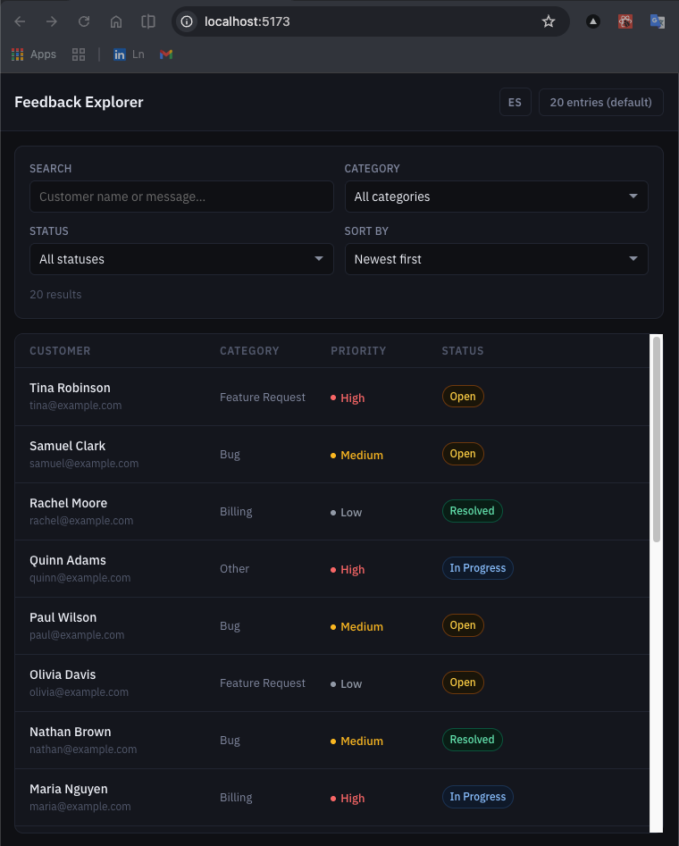
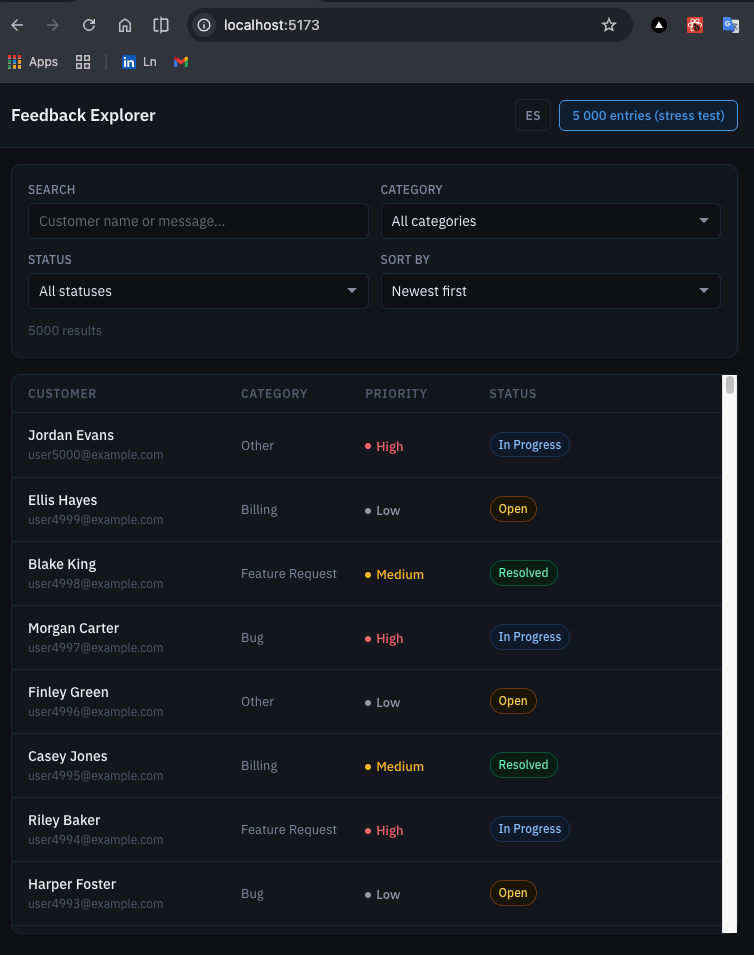
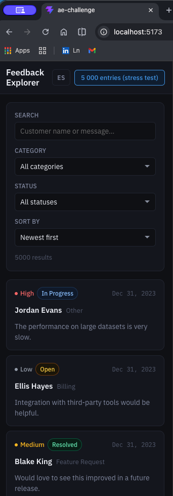
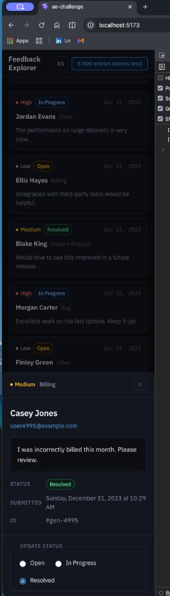

# Feedback Explorer

Internal tool for support teams to browse, search, filter, and manage customer feedback.

Built with React 19 + TypeScript + Vite.

## Preview

### Desktop

| Default (20 entries) | Stress test (5,000 entries) |
|---|---|
|  |  |

### Mobile

| Card list | Detail modal |
|---|---|
|  |  |

## Setup

```bash
git clone https://github.com/sanchezdamianj/ae-challenge.git
cd ae-challenge
pnpm install
pnpm dev
```

Tests:

```bash
pnpm test
```

Requires Node 18+.

## Features

- Search by customer name or message (debounced)
- Filter by category and status
- Sort by date or priority
- Detail panel with full feedback info and status update
- Keyboard navigation: Tab to focus rows, ↑↓ arrows to navigate, Enter/Space to open detail
- Filters persisted in localStorage across sessions
- Responsive: table on desktop, cards on mobile (≤639px)
- Dark mode via `prefers-color-scheme`
- Stress test mode: toggle to 5,000 generated entries to validate performance

## Notes

- Filtering and sorting live in `src/lib/filterFeedback.ts` so the hook layer stays small and the logic is easy to test.
- For the large dataset mode I used simple row virtualization instead of pagination, since it fits this internal tool better and keeps scanning fast.
- Filters persist in localStorage so your last state survives a refresh. The trade-off is that the view is not shareable through the URL.
- Status changes are local only, which matches the brief.

## GitHub

[github.com/sanchezdamianj](https://github.com/sanchezdamianj)
